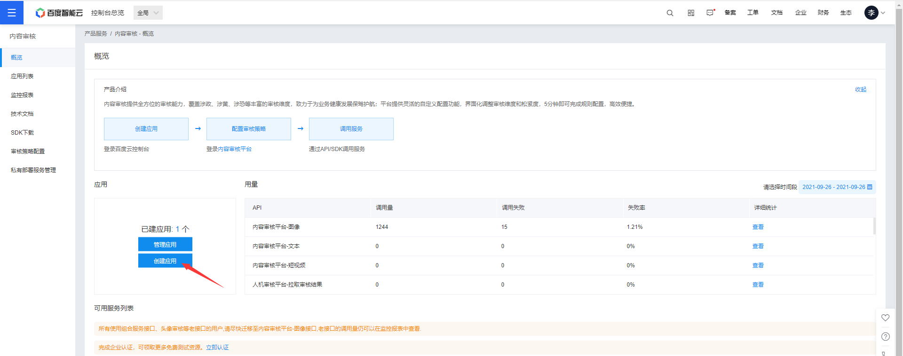
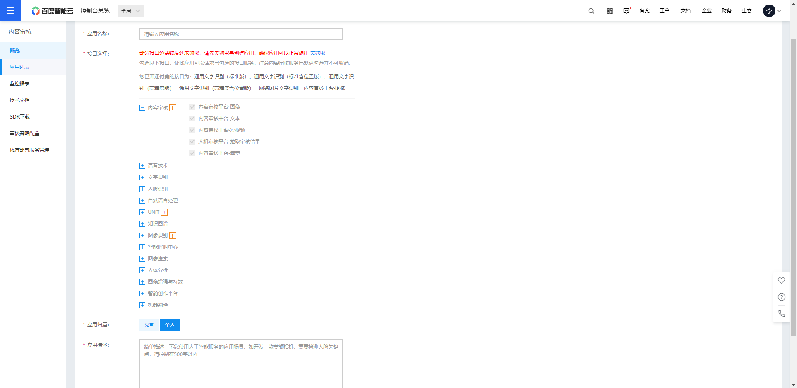
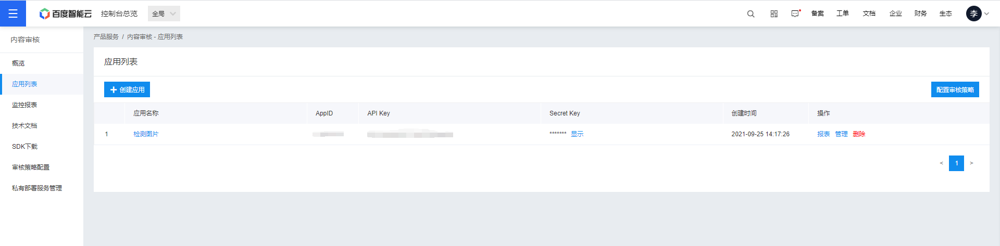
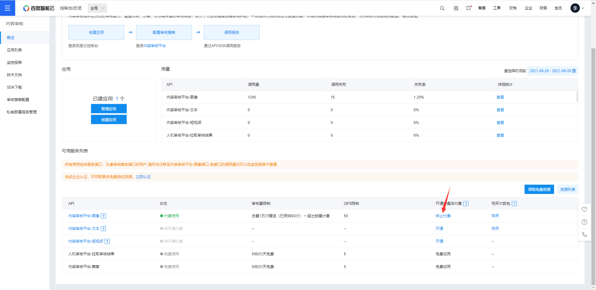
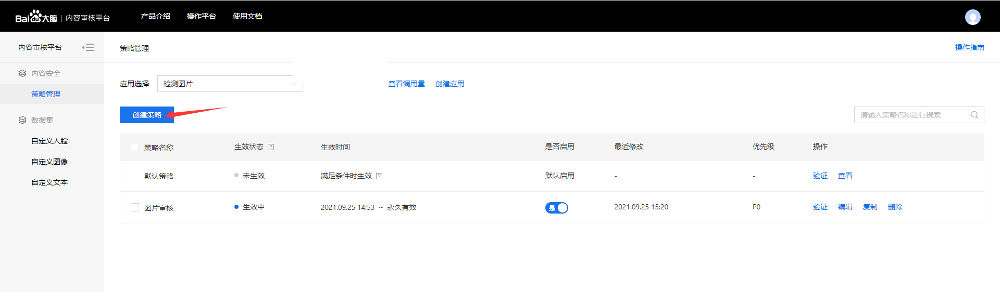
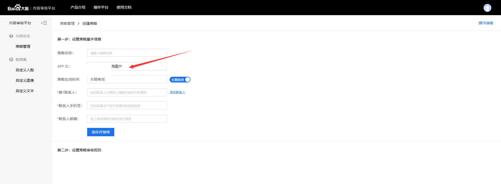
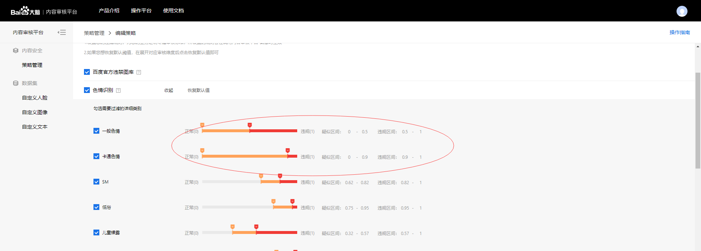
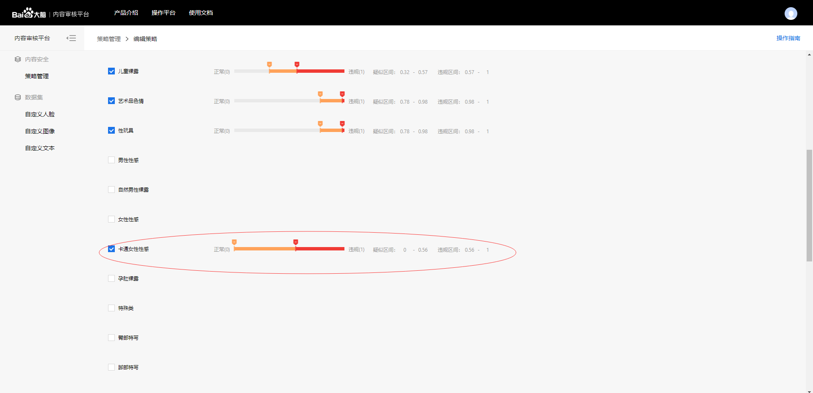
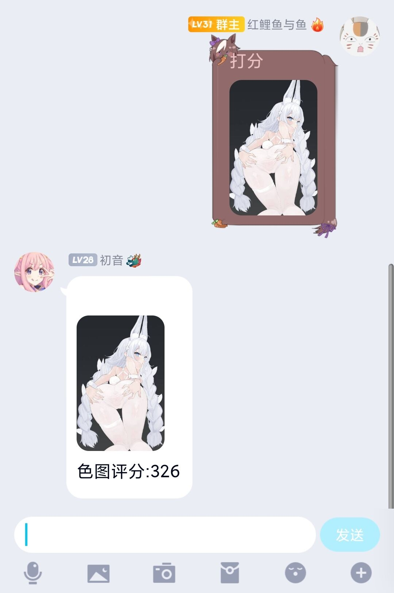

# SetuScore
一个为色图打分的插件

## 盐的fork version

1. 将色图打分改为了常开的模式，每次发送图片都会自动打分, 疑似高于350才会向群内发送提示
2. 对表情包进行了区分
3. 删除了数量限制
4. 将api的配置移动到了config文件夹下
5. 添加了数据库, 避免图片重复打分
6. 添加了可设置的禁言阈值, 高于阈值的图片将会被禁言

## 功能 

```text
[打分/评分] 图片 涩图打分
开启后将在群组内自动识别, 评分高于350才会提示分值
[禁言阈值 分数] 发高于阈值的图片将会被禁言
[取消禁言阈值] 取消当前群组的禁言阈值
```

## 更新
9.27
增加了卡通女性性感参数\
开始打分时会有提示\
调用api方式改为直接调用，不用再下载SDK，传图方式改为url 感谢[@LHXnois](https://github.com/LHXnois)\
修改了一些小问题

9.26
添加了对data的检测\
支持连续对话\
新增回复打分选项

## 使用说明

在 https://cloud.baidu.com/product/imagecensoring 页面开通服务

开通后进入管理台创建应用


名称和描述随便填一下就行


记住你的Api Key, Secret Key,填入`setu_score.py`里对应的位置


开通图片审核服务,有免费一万次记得领一下,用完的话就往账号里存十块钱,够用很久了


进入 https://ai.baidu.com/censoring#/strategylist 页面创建策略


这里应用选你刚才创建那个


色情疑似区间拉满(这一步很重要！),然后在页面最下面保存策略



把文件夹放入`modules`中并在`__bot__.py`中添加该插件

效果图:



## 致谢
连续对话代码参考(嗯缝)了 https://github.com/pcrbot/picfinder_take